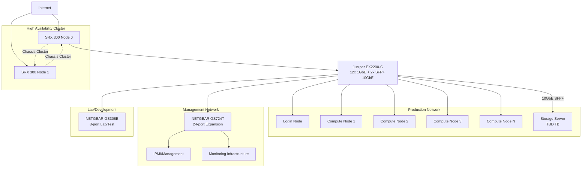

# Takt Cluster

Hello! I'm building the **Takt cluster** - a shared compute infrastructure for friends conducting ML research and training.

This article covers how the Takt cluster is being designed, built, and will be operated.

## Documentation

- **[Hardware Overview](hardware/README.md)** - Complete hardware specifications and procurement plans
- **[Rack Configuration](hardware/rack/README.md)** - Physical rack layout and positioning

## Status

Planning phase - hardware selection and procurement underway

## Takt Cluster Overview

While cloud compute is readily available, there's something special about having your own hardware for research and experimentation. The Takt cluster will provide a cost-effective, shared platform for friends to train models, run experiments, and learn HPC concepts together.

The planned Takt cluster will consist of:

| Component | Specification | Purpose |
|-----------|---------------|---------|
| Login Node | [TBD] | SSH gateway and job management |
| Compute Nodes | [TBD] GPUs, [TBD] CPU cores | ML training and compute workloads |
| Storage Server | [TBD] TB capacity | Shared datasets and user storage |
| Network | 10GbE interconnect | High-speed cluster communication |

Additional services will include a VPN server for secure remote access, automated backup systems, and web-based monitoring dashboards.

### Network Diagram

This is currently a high-level overview of the planned network architecture (subject to change as hardware is finalized):

### Job Scheduling with Slurm

Job scheduling will use [Slurm Workload Manager](https://slurm.schedmd.com/documentation.html) with GRES (Generic RESource) for precise GPU allocation across different hardware.

To simplify GRES configuration management, I've built a [custom generator tool](https://github.com/name/gres-generator) that automatically creates Slurm GRES configurations for GPU clusters and handles the mapping between GPUs and CPU cores. This will eliminate the manual configuration overhead when adding nodes with different GPU counts or types.

The tool will ensure efficient resource utilization by preventing the common problem where single-GPU jobs monopolize entire multi-GPU nodes, leaving resources idle.

### Monitoring Infrastructure

Following modern DevOps practices, I'm planning to implement:

- [Prometheus](https://prometheus.io/) for metrics collection
- [Grafana](https://grafana.com/) for visualization and dashboards
- Custom alerting for system health and resource utilization

### Configuration Management

All node setup and configuration will be managed through Ansible, ensuring consistent environments and rapid deployment of new nodes.

## User Experience

### Getting Started

New users will receive:

- Account setup and SSH key configuration
- Cluster orientation and best practices guide
- Sample job scripts and tutorials
- Access to shared datasets and models

### Resource Sharing

Since this will be a collaborative environment, I'm planning fair-share scheduling to ensure everyone gets compute time while allowing for burst usage when the cluster is idle.

This will be managed through Slurm's fair-share scheduling policies, which prioritize jobs based on user history and resource usage.

### Support and Community

Questions, requests, and feedback will be handled through:

- Dedicated Slack channel for cluster users
- Documentation wiki with examples and troubleshooting
- Semi-regular "office hours" for hands-on help

## Future Plans

### Phase 1: Foundation (2025)

- Core compute nodes and storage
- Basic job scheduling and monitoring
- User onboarding and documentation

### Phase 2: Enhancement (2025-2026)

- Additional compute capacity
- Advanced monitoring and optimization
- Container support and MLOps tools

### Phase 3: Specialization (TBD)

- Unknown.

## Join Us

Interested in using the Takt cluster for your research? We're looking for:

- ML researchers and practitioners
- Students learning HPC concepts
- Anyone excited about collaborative computing

You can email me at [char@char.blog](mailto:char@char.blog) or reach out on [Twitter](https://twitter.com/cunjur) to get involved.

---

*The Takt cluster is named after the conductor's baton - coordinating diverse computational resources into harmonious research.*
