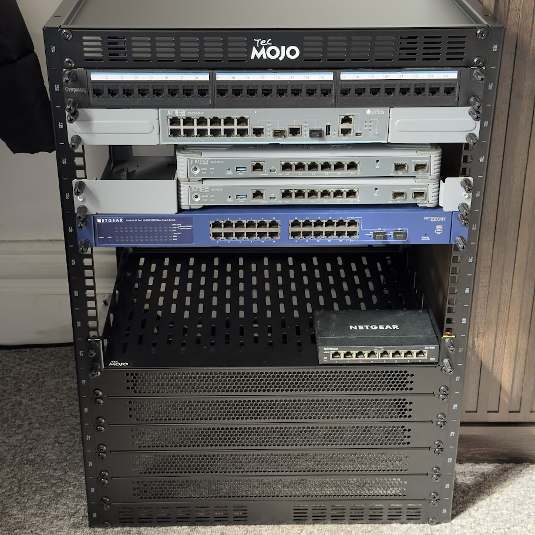

# Rack Configuration

## Current Setup

*Tecmojo 16U rack with networking equipment installed*

## Current Layout (14U Available)

| U Position | Equipment | Status |
|------------|-----------|--------|
| **U1** | Patch Panel (24-port) | Installed - Cable management at top |
| **U2** | Juniper EX2200-C | Installed - Main cluster switch |
| **U3** | Juniper SRX300 #1 | Installed - Primary firewall |
| **U4** | Juniper SRX300 #2 | Installed - Secondary firewall |
| **U5** | NETGEAR GS724T | Installed - Management network |
| **U6** | Empty | Available for expansion |
| **U7** | Empty | Available for expansion |
| **U8** | Empty | Available for expansion |
| **U9** | 1U Shelf | Installed - Small equipment/tools |
| **U10** | 1U Cover | Clean appearance |
| **U11** | 1U Cover | Clean appearance |
| **U12** | 1U Cover | Clean appearance |
| **U13** | 1U Cover | Clean appearance |
| **U14** | 1U Cover | Clean appearance |

**Back Mount U8:** 6-Way Switched PDU

## Target Configuration

| Zone | U Positions | Purpose | Equipment |
|------|-------------|---------|-----------|
| **Network** | U1-U5 | Core networking | Patch panel, switches, firewalls |
| **Management** | U6 | Login/head node | 1U shelf with mini-PC/NUC |
| **Compute** | U7-U9 | GPU nodes | Tesla T4 compute nodes |
| **Expansion** | U10-U12 | Future growth | Additional compute or storage |
| **Storage** | U13-U14 | High-capacity storage | File server with high-density drives |

## Proposed Changes

**Move shelf from U9 to U6** to create a dedicated management zone directly below networking equipment. This positions the login node for easy access while maintaining logical network adjacency.

**Establish compute zone in U7-U9** for GPU-accelerated nodes. Central positioning optimizes weight distribution and thermal management for high-performance hardware.

**Reserve bottom positions (U13-U14) for storage** to place heaviest equipment at the lowest point for rack stability and optimal cooling for storage drives.

## Design Principles

- **Weight distribution**: Heavy equipment at bottom for stability
- **Thermal management**: Heat-generating components positioned for optimal airflow
- **Logical grouping**: Related equipment clustered for easier management
- **Future expansion**: Scalable design with room for growth
- **Cable management**: Organized routing through patch panel at top

## Expansion Capabilities

The Tecmojo 16U rack is stackable, allowing for vertical expansion when additional compute or storage capacity is needed.
